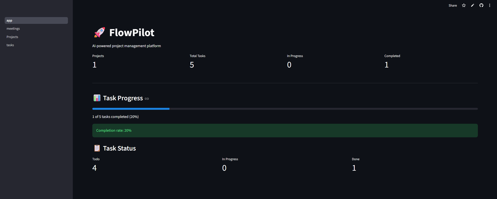
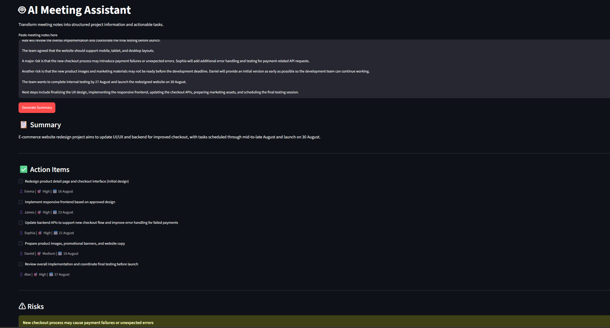
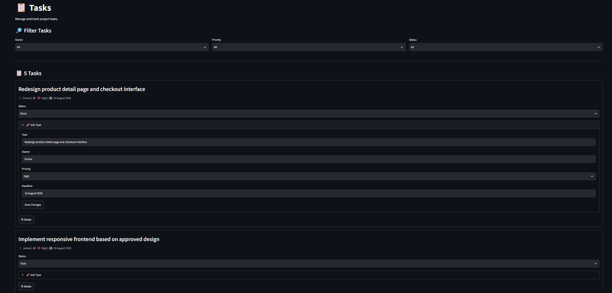
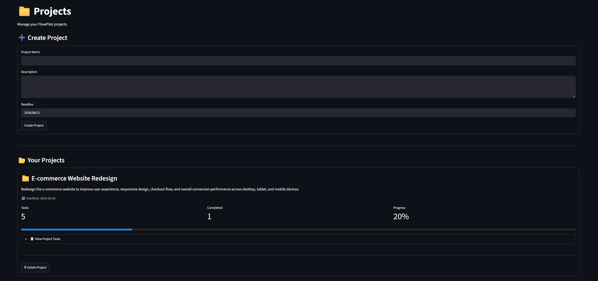
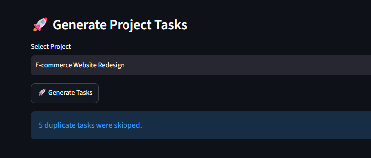

  

# 🚀 FlowPilot

AI-powered project management platform that transforms meeting notes into structured insights and actionable tasks.

[🚀 Live Demo](https://flowpilot.streamlit.app/)

## Overview

FlowPilot is an AI-powered project management platform designed to turn unstructured meeting notes into actionable project tasks.

Users can paste meeting notes into the AI Meeting Assistant and automatically generate meeting summaries, action items, project risks, and next steps.

Action items can then be converted into project tasks and managed through projects, task status, deadlines, and progress tracking.

## Key Features

### 🤖 AI Meeting Assistant

- Generate meeting summaries from unstructured meeting notes
- Extract action items and task owners
- Identify project risks
- Generate next steps
- Return structured data for task generation

### 📋 Automatic Task Generation

- Convert AI-generated action items into project tasks
- Assign task owners
- Set priorities and deadlines
- Detect and skip duplicate tasks

### 📁 Project Management

- Create and manage projects
- View project-specific tasks
- Track project completion progress
- Delete projects and associated tasks

### 📊 Dashboard

- View total projects
- View total tasks
- Track tasks in progress
- Track completed tasks
- Monitor overall task completion progress

## Screenshots

### AI Meeting Assistant

### Task Management

### Project Management

### Duplicate Task Detection

## Tech Stack

- Python
- Streamlit
- SQLite
- OpenRouter API
- Google Gemma
- python-dotenv

## Workflow

Meeting Notes → AI Meeting Assistant → Summary / Action Items / Risks / Next Steps → Task Generation → Duplicate Detection → SQLite Database → Projects / Tasks → Dashboard

## Project Structure

- `app.py` — Main Streamlit dashboard
- `database.py` — SQLite database operations
- `llm.py` — LLM API integration and structured response processing
- `pages/meetings.py` — AI Meeting Assistant and task generation
- `pages/tasks.py` — Task management
- `pages/Projects.py` — Project management
- `screenshots/` — Project screenshots
- `requirements.txt` — Python dependencies

## Local Setup

### 1. Clone the repository

git clone https://github.com/LilLexW/FlowPilot

cd FlowPilot

### 2. Install dependencies

pip install -r requirements.txt

### 3. Configure the API key

Create a `.env` file in the project root:

OPENROUTER_API_KEY=your_api_key

### 4. Run the application

streamlit run app.py

## Security

API keys are stored using environment variables and are not included in the repository.

For the deployed application, API credentials are managed through Streamlit Secrets.

## Future Improvements

- User authentication
- Multi-user project workspaces
- Cloud database integration
- Calendar integration
- Advanced project analytics
- More AI-powered project insights
